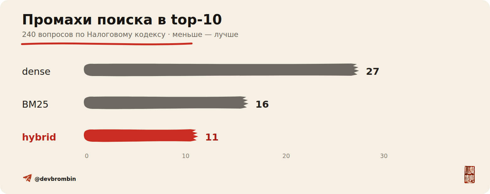
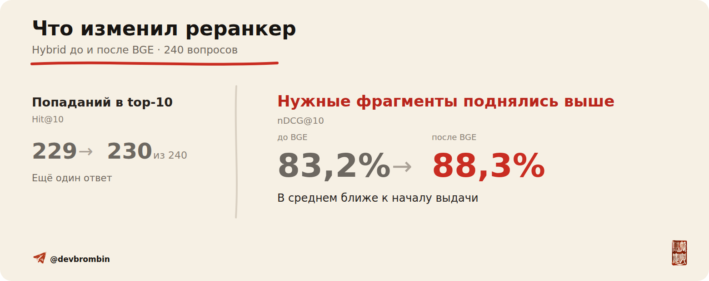

<p align="center">
  
</p>

# RAGVIEW

[](https://github.com/br0mberg/ragview-rag-types/actions/workflows/ci.yml)


[](LICENSE)

Java-стенд к статье о гибридном поиске и реранкинге. Он сравнивает dense,
BM25, hybrid RRF, простую маршрутизацию и `bge-reranker-v2-m3` на одной
выборке вопросов по Налоговому кодексу.

Генерации ответа здесь нет. Стенд измеряет только retrieval: нашёлся ли нужный
фрагмент и насколько высоко он оказался в выдаче.

## Результат

Корпус: 815 статей НК РФ, 2074 чанка. Выборка: 120 пар вопросов. В каждой паре
есть обычная формулировка без номера статьи и версия с точной ссылкой на ту же
статью.

| Первый этап | Hit@10 | Кандидат найден в top-50 | После BGE, Hit@10 | После BGE, nDCG@10 |
|---|---:|---:|---:|---:|
| dense | 213 / 240 | 234 / 240 | 230 / 240 | 0,882 |
| BM25 | 224 / 240 | 234 / 240 | 228 / 240 | 0,878 |
| hybrid RRF | **229 / 240** | **238 / 240** | **230 / 240** | **0,883** |

<p align="center">
  
</p>

<p align="center">
  
</p>

По Hit@10 BGE добавил hybrid одну находку. Его основная работа видна по
nDCG@10: метрика выросла с `0,832` до `0,883`, то есть нужные фрагменты в
среднем поднялись выше.

Правило `явная ссылка на статью -> BM25, иначе hybrid` сохранило `228 / 240`
находок против `229 / 240` у постоянного hybrid. Одновременно оно подняло
nDCG@10 с `0,832` до `0,847` и вдвое сократило число вычислений эмбеддинга
запроса.

Это результат одного юридического корпуса, а не рейтинг методов вообще. Здесь
BM25 оказался сильным, а широкий rerank иногда поднимал шум. Код нужен, чтобы
повторить сравнение на своих документах.

## Быстрая проверка

Нужна Java 21. Maven Wrapper уже лежит в репозитории.

```bash
./mvnw --batch-mode --no-transfer-progress test
```

BM25-smoke работает без GPU и внешних моделей:

```bash
RAGVIEW_STRATEGIES=bm25 \
RAGVIEW_DATASET_PATH=data/fixtures/smoke \
RAGVIEW_TOP_K=2 \
RAGVIEW_CANDIDATE_POOL=5 \
RAGVIEW_CANDIDATE_DUMP_LIMIT=5 \
RAGVIEW_RERANK_POOLS=2,5 \
RAGVIEW_WARMUP_QUERIES=0 \
RAGVIEW_OUTPUT=results/local/smoke/comparison.csv \
./mvnw --batch-mode --no-transfer-progress spring-boot:run
```

## Проверка таблицы

В `results/article` лежат позиции каждого вопроса после retrieval, reranking и
маршрутизации. Скрипты анализа используют только стандартную библиотеку
Python.

```bash
python3 tools/analyze_retrieval.py \
  --input results/article/retrieval.csv \
  --output results/local/retrieval-analysis \
  --iterations 10000 --seed 20260803 --cluster-pairs

python3 tools/analyze_rerank.py \
  --input results/article/rerank.csv \
  --output results/local/rerank-analysis \
  --iterations 10000 --seed 20260803 --cluster-pairs

(cd results/article && sha256sum -c MANIFEST.sha256)
```

## Полный прогон

Для dense и BGE нужны Python 3.12+, [`uv`](https://docs.astral.sh/uv/) и NVIDIA
GPU. Ревизии моделей зафиксированы:

- `sergeyzh/BERTA@914c8c8aed14042ed890fc2c662d5e9e66b2faa7`;
- `BAAI/bge-reranker-v2-m3@953dc6f6f85a1b2dbfca4c34a2796e7dde08d41e`.

Сначала соберите актуальную редакцию НК РФ:

```bash
python3 tools/build_tax_code_corpus.py \
  --output data/local/tax-code-current --workers 6 --refresh
cp data/eval/v2/questions.json data/local/tax-code-current/questions.json
```

Затем поднимите локальный сервер моделей:

```bash
uv run tools/embedding_server.py \
  --profile berta --batch-size 64 --device cuda \
  --with-reranker --rerank-batch-size 64 --rerank-precision fp16
```

В другом терминале запустите Java:

```bash
SPRING_PROFILES_ACTIVE=berta \
RAGVIEW_DATASET_PATH=data/local/tax-code-current \
RAGVIEW_STRATEGIES=dense,bm25,hybrid,routing \
RAGVIEW_RERANK_ENABLED=true \
RAGVIEW_OUTPUT=results/local/full/comparison.csv \
./mvnw --batch-mode --no-transfer-progress spring-boot:run
```

## Что лежит в репозитории

```text
src/               Java-код и тесты
tools/             сервер моделей, сборщик корпуса и анализ результатов
data/eval/v2/      вопросы и разметка
data/fixtures/     маленький BM25-smoke
results/article/   позиции запросов и контрольные суммы
docs/              обложка и графики
```

Сводный текст НК РФ был сохранён 11 июля 2026 года. Полный снимок не
публикуется, поэтому заново скачанная редакция может дать другие абсолютные
числа. Происхождение данных описано в [`DATA_SOURCES.md`](DATA_SOURCES.md).

Файл [`ARTICLE.md`](ARTICLE.md) оставлен под текст статьи и ссылку на Habr.

Автор: Андрей Бромбин, [Telegram](https://t.me/devbrombin). Код распространяется
по [MIT License](LICENSE).
