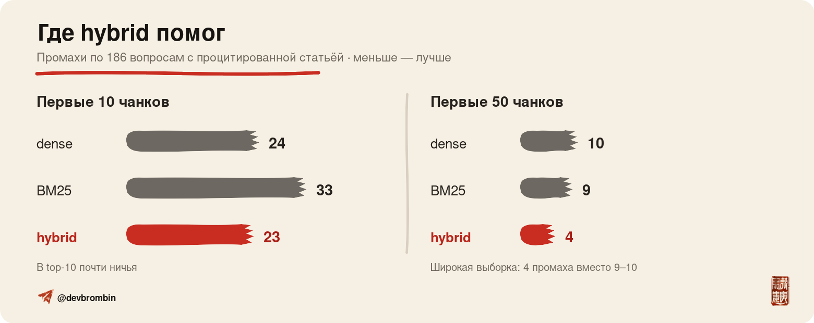
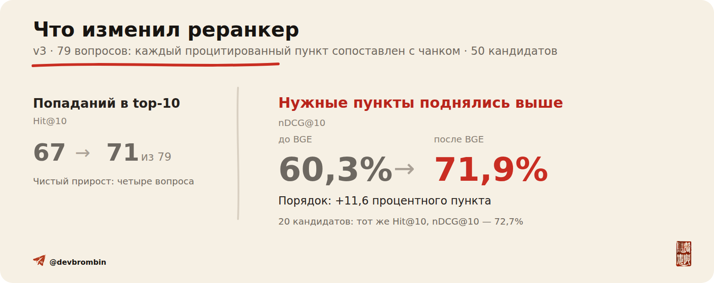

<p align="center">
  
</p>

# RAGVIEW


[](https://github.com/br0mberg/ragview-rag-types/actions/workflows/ci.yml)
[](LICENSE)

Java-стенд к статье о гибридном поиске и реранкинге. Он сравнивает dense,
Lucene BM25, RRF и `bge-reranker-v2-m3` на корпусе Налогового кодекса.
Генерации ответа здесь нет: эксперимент заканчивается на retrieval и порядке
чанков перед LLM.

## Что получилось

На предварительно отфильтрованном техническом срезе внешних вопросов ФНС hybrid почти не
изменил первую десятку, но собрал более полную выборку из 50 кандидатов. Это диагностическая
глубина первого этапа, а
не рекомендация отправлять реранкеру все 50 документов.

| Первый этап | Процитированная статья в top-10 | В первых 50 чанках |
|---|---:|---:|
| BERTA dense | 162 / 186 | 176 / 186 |
| Lucene BM25 | 153 / 186 | 177 / 186 |
| BERTA + BM25, RRF | **163 / 186** | **182 / 186** |

Поштучный разбор показал, где именно появилась разница. На `k=10` hybrid
дал восемь новых попаданий и потерял семь dense-находок. На `k=50` — шесть
новых попаданий без единого полного промаха. При этом в пяти вопросах с
несколькими ссылками hybrid потерял часть процитированных статей.
Это article-level диагностика, а не оценка релевантности конкретного чанка или качества
ответа RAG.

<p align="center">
  
</p>

Для реранкера собран отдельный диагностический срез из 79 вопросов, где
процитированный пункт НК РФ однозначно сопоставляется с чанком. При основном cutoff 50 BGE
поднял `cited-clause nDCG@10` с `0,603` до `0,719`, а `Hit@10` — с `67 / 79`
до `71 / 79`.

<p align="center">
  
</p>

На 20 кандидатах получились те же `71 / 79` и nDCG@10 `0,727`. Это
sensitivity-наблюдение на том же наборе, а не независимо подтверждённый
оптимум.

Чистый локальный прогон на RTX 5060 Ti измерял только вызов BGE. Для каждой
глубины выполнено 720 замеров после прогрева; порядок вопросов и глубин
детерминированно перемешивался.

| Кандидатов | p50 | p95 |
|---:|---:|---:|
| 10 | 203 мс | 229 мс |
| 20 | 414 мс | 460 мс |
| 30 | 633 мс | 689 мс |
| 50 | 1064 мс | 1152 мс |

На этом корпусе переход с 20 на 50 кандидатов не улучшил Hit@10, но увеличил
медианную задержку в 2,6 раза. Это измерение одной машины без конкурентной
нагрузки, а не SLO для production.

## Паспорт эксперимента

| Параметр | Значение |
|---|---|
| Корпус | НК РФ, редакция от 11 июля 2026 года, 2074 чанка |
| Вопросы | 240 записей FAQ ФНС из 14 категорий, снимок от 13 августа 2026 года |
| Отбор | frame зафиксирован до retrieval; только 3 вопроса содержат номер статьи |
| Dense | `sergeyzh/BERTA@914c8c8aed14042ed890fc2c662d5e9e66b2faa7`, mean pooling |
| BM25 | Lucene 10.3.2, `RussianAnalyzer` |
| Объединение выдач | Java RRF, `k = 60`, позиции считаются с единицы |
| Reranker | `BAAI/bge-reranker-v2-m3@953dc6f6f85a1b2dbfca4c34a2796e7dde08d41e` |
| Запуск BGE | CUDA, fp16, batch 64, `maxLength=1024` |
| Qdrant | 1.19.0; отдельно проверены native sparse и встроенный RRF |

Правило cited-clause-среза зафиксировано до агрегирования его метрик и не
читает вопрос, ответ ФНС, позиции или model score. Это диагностический срез:
сам BGE-прогон существовал раньше структурной разметки.

## Проверить опубликованные результаты

Нужна Java 21. Все команды запускаются из корня репозитория.

```bash
./mvnw --batch-mode --no-transfer-progress test

(cd results/v3-citation-silver && sha256sum -c MANIFEST.public.sha256)
(cd results/v3-bge-cited-clause && sha256sum -c MANIFEST.public.sha256)
(cd results/v3-bge-latency && sha256sum -c MANIFEST.public.sha256)

bash scripts/check-public-release.sh
```

Тест `PublicV3ArtifactsContractTest` заново собирает агрегаты из публичных
построчных файлов, пересчитывает p50/p95 из 2880 latency-измерений и проверяет
хэши. Метрики BGE можно пересчитать отдельно:

```bash
./mvnw -q -DskipTests compile dependency:build-classpath \
  -Dmdep.outputFile=target/runtime-classpath.txt

java -cp "target/classes:$(<target/runtime-classpath.txt)" \
  ru.brombin.ragview.eval.FnsFaqBgeCutoffEvaluator \
  --bge-manifest results/v3-bge-cited-clause/bge-manifest.json \
  --targets-manifest results/v3-bge-cited-clause/cited-clause-manifest.json \
  --cutoffs 10,20,30,50 \
  --output results/local/v3-bge-recomputed

cmp results/v3-bge-cited-clause/aggregate.csv \
  results/local/v3-bge-recomputed/aggregate.csv
cmp results/v3-bge-cited-clause/per-query.csv \
  results/local/v3-bge-recomputed/per-query.csv

python3 tools/audit_bge_token_lengths.py \
  --verify-summary results/v3-bge-cited-clause/token-length-summary.json
```

Аудит длин хранит 12 000 пар `вопрос — кандидат` и 95 целевых пар без
исходных текстов. Из них пересчитываются обе цифры из статьи: лимит 512
обрезал бы 81 из 95 целевых пар, а при 1024 длиннее лимита остались 35 из
12 000 пар и ни одной целевой. Полная ретокенизация требует локальных снимков с хэшами,
указанными в `token-length-summary.json`.

`FnsFaqBgeLatencyRunner` повторяет latency-прогон по локальным frozen-входам.
Он проверяет SHA вопросов, корпуса и BGE-выдачи, сверяет `/health` работающего
реранкера, выполняет прогрев и перемешивает четыре глубины между вопросами.
Публичные `samples.csv` не содержат тексты или идентификаторы, но позволяют
заново посчитать все значения таблицы задержек.

Публичный пакет позволяет проверить хэши, позиции и расчёт метрик. Он не
воспроизводит frozen retrieval побайтово: в этот release пока не включены тексты
корпуса и FAQ. Это осторожная release-policy, а не утверждение о прямом запрете.
Причины и источники разобраны в [`DATA_SOURCES.md`](DATA_SOURCES.md).

## Собрать актуальный FAQ

Код Java-сборщика опубликован, сама выгрузка в Git не входит. Перед первым
запросом сборщик проверяет `robots.txt`. Он делает не более одного запроса в 500 мс,
останавливается на `403`, а для `429` и `5xx` соблюдает `Retry-After` и ограничивается
четырьмя попытками.

```bash
./mvnw -q -DskipTests compile dependency:build-classpath \
  -Dmdep.outputFile=target/runtime-classpath.txt

java -cp "target/classes:$(<target/runtime-classpath.txt)" \
  ru.brombin.ragview.eval.FnsFaqCollector \
  --config data/eval/v3_source_config.json \
  --output data/local/fns-current
```

Команда создаёт новый локальный снимок. Он может отличаться от зафиксированного
снимка от 13 августа 2026 года. Сам запуск сборщика не меняет опубликованные
метрики. Повторный прогон нужен только если заменить зафиксированный benchmark-frame.

## Запустить код на своих данных

Smoke-тест BM25 не требует GPU и внешних моделей:

```bash
RAGVIEW_STRATEGIES=bm25 \
RAGVIEW_DATASET_PATH=data/fixtures/smoke \
RAGVIEW_TOP_K=2 \
RAGVIEW_CANDIDATE_POOL=5 \
RAGVIEW_CANDIDATE_DUMP_LIMIT=5 \
RAGVIEW_RERANK_POOLS=2,5 \
RAGVIEW_WARMUP_QUERIES=0 \
RAGVIEW_OUTPUT=results/local/smoke/comparison.csv \
./mvnw --batch-mode --no-transfer-progress spring-boot:run
```

Сборка корпуса, сервер BERTA/BGE, Qdrant и полный порядок прогона описаны в
[`PROTOCOL_V3.md`](data/eval/PROTOCOL_V3.md). Определения метрик и ограничения
срезов находятся в
[`METRIC_CONTRACT_V3.md`](data/eval/METRIC_CONTRACT_V3.md).

## Что опубликовано

```text
src/                         Java-код, FAQ-сборщик и тесты
tools/                       сборщик корпуса и локальный сервер моделей
data/fixtures/               маленький открытый smoke-набор
data/eval/                   протоколы, конфигурации и хэши
results/v3-citation-silver/  article-level метрики по qid
results/v3-bge-cited-clause/ cited-clause labels, ранги BGE, длины пар и метрики
results/v3-bge-latency/      обезличенные измерения задержки BGE
docs/                        обложка и актуальные графики
```

Полный снимок вопросов и ответов не включён в репозиторий: условия ФНС не дают
интернет-сервисам явного разрешения на массовую перепубликацию. Сборщик получает
данные непосредственно с сайта ФНС, сохраняет ссылки на источники и предназначен
для локального воспроизведения эксперимента.

В release также не входят полный текст НК РФ, review packets, веса моделей и
локальные результаты. Они хранятся в `data/local/` и `results/local/`, оба
каталога игнорируются. Release-check дополнительно проверяет имена, содержимое,
бинарные форматы, ключи и SHA-256 разрешённых изображений.

Происхождение данных описано в [`DATA_SOURCES.md`](DATA_SOURCES.md), границы
лицензии — в [`THIRD_PARTY.md`](THIRD_PARTY.md). Репозиторий не является
правовым справочником, а structural silver не оценивает полноту ответа или
юридическую достаточность нормы.

Исторический `v2` сохранён как регрессионный тест. В выводах статьи он не
используется.

## Статья и лицензия

Ссылка на публикацию появится в [`ARTICLE.md`](ARTICLE.md). Автор — Андрей
Бромбин, [Telegram](https://t.me/devbrombin).

Авторский код распространяется по [MIT License](LICENSE). Лицензия не
распространяется на материалы ФНС, веса моделей, статью и иллюстрации.
